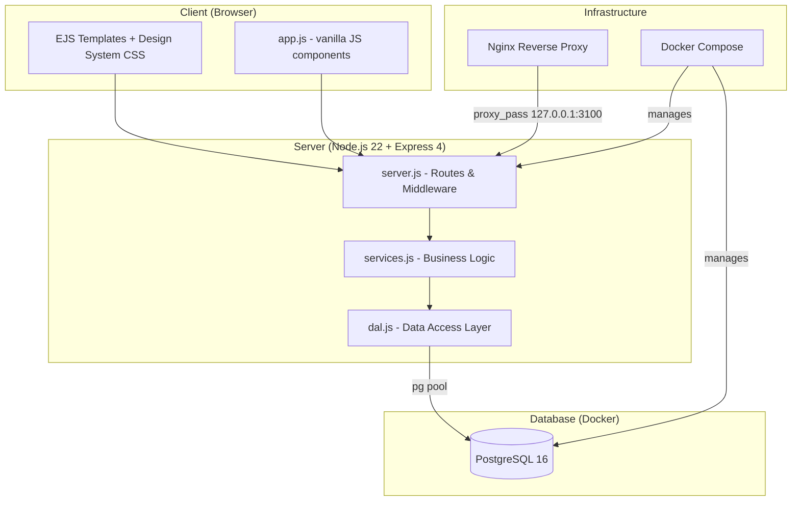
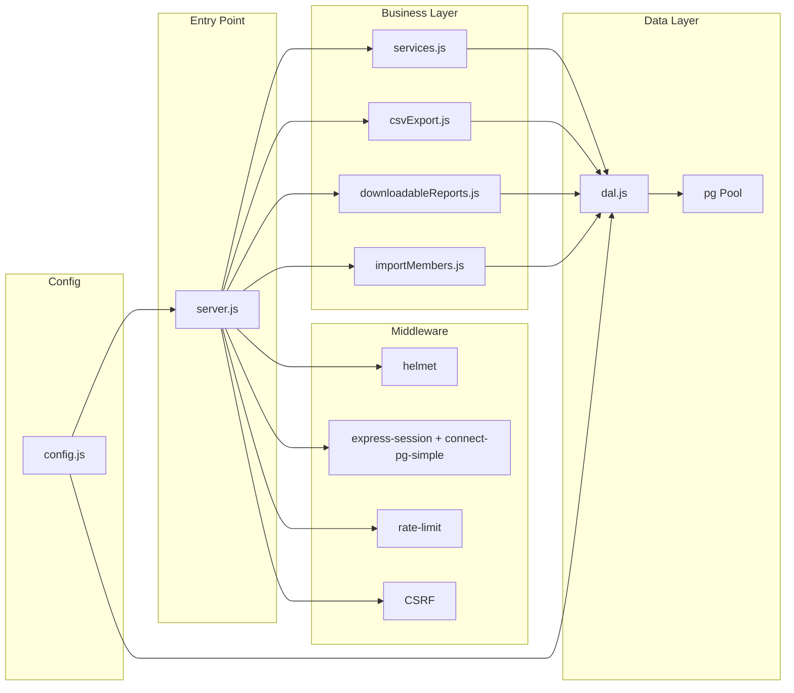

# Design Document: UI Overhaul & PostgreSQL Migration

## Overview

This design transforms the existing "KSJI Accounts" application into "Treasurio by TILC" — a generic group/club financial management tool. The effort spans four interconnected concerns:

1. **Design System & UI Overhaul** — Replace the current flat CSS with a token-based design system, add sidebar navigation, redesign the dashboard, introduce reusable data-table/form/toast/modal components, and ensure accessibility (WCAG 2.1 AA) and responsive behavior down to 320px.
2. **PostgreSQL Migration** — Swap `better-sqlite3` for the `pg` library with a connection pool, introduce a data access layer (DAL) exporting `query`/`queryOne`/`run`/`transaction`/`shutdown`, rewrite all SQL from SQLite dialect to PostgreSQL, and provide an idempotent migration script plus a one-time SQLite→Postgres data migration tool.
3. **VPS Platform Integration** — Restructure deployment artifacts into the `apps/treasurio/` convention with deploy, backup, restore, and remove scripts, bind only to 127.0.0.1 for nginx reverse proxy, add a `/health` endpoint, and switch to a multi-stage Alpine Dockerfile.
4. **Rebrand** — Configurable GROUP_NAME, GROUP_CURRENCY env vars, rename package to `treasurio`, update all references.

The application remains server-rendered (Express + EJS) with minimal client-side JavaScript. No SPA framework is introduced. All UI interactivity (sort, pagination, search, toasts, modals) is vanilla JS in a single bundled `app.js` file.

## Architecture

### High-Level Architecture



### Module Architecture



### Key Architectural Decisions

| Decision | Rationale |
|----------|-----------|
| Keep server-rendered EJS | No benefit to SPA for this use case; fewer dependencies, simpler deployment, accessible by default |
| Single `app.css` with design tokens | Avoids build tooling (Sass, PostCSS); CSS custom properties are well-supported in all target browsers |
| Vanilla JS for interactivity | Table sort/filter/pagination, toasts, modals are ~400 lines total; a framework adds unnecessary weight |
| `pg` library directly (no ORM) | The existing code is already raw SQL; an ORM adds abstraction overhead without proportional benefit for this schema size |
| DAL with `query`/`queryOne`/`run` | Contains all PostgreSQL dialect in one module; business layer remains dialect-agnostic |
| `connect-pg-simple` for sessions | Proven library, uses the same pool, avoids a custom session store implementation |
| Multi-stage Alpine Dockerfile | Smaller image (~180MB vs ~350MB), faster deploys on VPS |

## Components and Interfaces

### 1. Design System (`src/public/app.css`)

The existing CSS already defines custom properties. This will be expanded:

**Token Categories:**
- **Colors**: Primary (blue scale 50–900), neutral (gray scale 50–900), success/warning/danger semantic scales (3 shades each)
- **Spacing**: 4px base: `--space-1` (4px) through `--space-8` (32px)
- **Border radius**: `--radius-sm` (4px), `--radius-md` (8px), `--radius-lg` (12px)
- **Typography**: System font stack, sizes for h1–h4, body, caption, label
- **Transitions**: `--transition-hover` (150ms), `--transition-focus` (100ms), `--transition-panel` (250ms)
- **Focus**: `--focus-ring-width` (2px), `--focus-ring-offset` (3px), `--focus-ring-color` (primary)

**Component Styles:**
- `.sidebar` — Fixed left panel, 240px wide
- `.data-table` — Sortable, paginated table
- `.form-group`, `.fieldset` — Grouped form fields
- `.toast` — Notification overlay
- `.modal` — Confirmation dialog
- `.metric-card` — Dashboard summary card
- `.badge` — Status/role indicators
- `.btn`, `.btn--primary`, `.btn--danger`, `.btn--secondary` — Button variants

### 2. Client-Side JavaScript (`src/public/app.js`)

Expanded from current ~20 lines to handle:

```typescript
// Conceptual interface (implemented as vanilla JS modules)
interface DataTable {
  init(tableEl: HTMLElement): void;
  sort(column: string, direction: 'asc' | 'desc'): void;
  filter(term: string): void;
  paginate(page: number, pageSize: number): void;
}

interface Toast {
  show(message: string, type: 'success' | 'danger', duration?: number): void;
  dismiss(id: string): void;
}

interface Modal {
  open(options: { title: string; body: string; onConfirm: () => void }): void;
  close(): void;
}

interface Sidebar {
  toggle(): void;
  setActive(path: string): void;
}
```

### 3. EJS Layout Structure

```
src/views/
├── layout.ejs              (main layout with sidebar, skip-nav, toast container)
├── partials/
│   ├── sidebar.ejs         (navigation groups, user info, sign-out)
│   ├── topbar-mobile.ejs   (hamburger + brand for ≤768px)
│   ├── toast-container.ejs (toast stack region)
│   ├── modal.ejs           (reusable modal shell)
│   ├── data-table.ejs      (table component partial)
│   ├── pagination.ejs      (pagination controls)
│   ├── csrf.ejs            (existing)
│   └── print-header.ejs    (print-only header)
├── dashboard.ejs
├── transactions.ejs
├── members.ejs
├── ... (existing views refactored)
```

### 4. Data Access Layer (`src/dal.js`)

```javascript
// Exported interface
module.exports = {
  /**
   * Execute a query returning all matching rows.
   * @param {string} sql - SQL with $1, $2 placeholders
   * @param {Array} params - Parameter values
   * @returns {Promise<Array<object>>} Row objects
   */
  query(sql, params = []),

  /**
   * Execute a query returning the first row or null.
   * @param {string} sql - SQL with $1, $2 placeholders
   * @param {Array} params - Parameter values
   * @returns {Promise<object|null>}
   */
  queryOne(sql, params = []),

  /**
   * Execute a statement (INSERT/UPDATE/DELETE).
   * @param {string} sql - SQL with $1, $2 placeholders
   * @param {Array} params - Parameter values
   * @returns {Promise<{rowCount: number, rows: Array}>}
   */
  run(sql, params = []),

  /**
   * Execute multiple statements in a transaction.
   * @param {function(client)} callback - Async function receiving a client
   * @returns {Promise<any>} Return value of callback
   */
  transaction(callback),

  /**
   * Drain the connection pool (for graceful shutdown).
   * @returns {Promise<void>}
   */
  shutdown(),

  /**
   * Audit log helper.
   */
  audit(userId, action, entity, entityId, details, options)
};
```

### 5. Config (`src/config.js`)

Extended with new environment variables:

```javascript
module.exports = {
  // Existing
  port: Number(process.env.PORT || 3000),
  sessionSecret: process.env.SESSION_SECRET || 'dev-secret-change-in-production',
  n8nApiToken: process.env.N8N_API_TOKEN || 'dev-n8n-token',
  secureCookies: process.env.SECURE_COOKIES === '1',
  requireSecret: process.env.NODE_ENV === 'production',

  // New - PostgreSQL
  databaseUrl: process.env.DATABASE_URL || null,
  pgHost: process.env.PGHOST || 'localhost',
  pgPort: Number(process.env.PGPORT || 5432),
  pgDatabase: process.env.PGDATABASE || 'treasurio',
  pgUser: process.env.PGUSER || 'treasurio',
  pgPassword: process.env.PGPASSWORD || '',
  pgPoolSize: Math.min(100, Math.max(1, Number(process.env.PG_POOL_SIZE || 10))),

  // New - Branding
  groupName: process.env.GROUP_NAME || 'My Group',
  groupCurrency: process.env.GROUP_CURRENCY || 'GHS',

  // New - Paths (removed dbPath)
  // dbPath removed — no longer needed
};
```

### 6. Session Store

Replace custom `SQLiteSessionStore` with `connect-pg-simple`:

```javascript
const pgSession = require('connect-pg-simple')(session);

app.use(session({
  store: new pgSession({
    pool: pool,           // reuse DAL pool
    tableName: 'sessions',
    pruneSessionInterval: 60 * 60  // 60 minutes
  }),
  secret: sessionSecret,
  resave: false,
  saveUninitialized: false,
  cookie: { httpOnly: true, sameSite: 'lax', secure: secureCookies, maxAge: 86400000 }
}));
```

### 7. Migration Script (`src/migrate.js`)

Idempotent PostgreSQL schema creation:
- Uses `CREATE TABLE IF NOT EXISTS` for all tables
- Uses `CREATE INDEX IF NOT EXISTS` for all indexes
- Seeds default data only when tables are empty
- Creates session table for `connect-pg-simple`

### 8. Data Migration Tool (`src/tools/migrate-sqlite-to-pg.js`)

One-time script:
- Reads SQLITE_PATH env var
- Validates source exists and is valid SQLite
- Checks target PG tables are empty
- Migrates in dependency order within a single transaction
- Resets SERIAL sequences
- Logs per-table progress
- Verifies row counts

### 9. Docker Compose (`docker-compose.yml`)

```yaml
services:
  postgres:
    image: postgres:16-alpine
    volumes:
      - pgdata:/var/lib/postgresql/data
    environment:
      POSTGRES_DB: ${PGDATABASE:-treasurio}
      POSTGRES_USER: ${PGUSER:-treasurio}
      POSTGRES_PASSWORD: ${PGPASSWORD:-changeme}
    healthcheck:
      test: ["CMD-SHELL", "pg_isready -U ${PGUSER:-treasurio}"]
      interval: 5s
      timeout: 5s
      retries: 5
      start_period: 10s
    networks:
      - treasurio-net
    restart: unless-stopped

  accounts:
    build: .
    ports:
      - "127.0.0.1:${APP_PORT:-3100}:3000"
    environment:
      PGHOST: postgres
      PGPORT: 5432
      PGDATABASE: ${PGDATABASE:-treasurio}
      PGUSER: ${PGUSER:-treasurio}
      PGPASSWORD: ${PGPASSWORD:-changeme}
      SESSION_SECRET: ${SESSION_SECRET}
      N8N_API_TOKEN: ${N8N_API_TOKEN}
      GROUP_NAME: ${GROUP_NAME:-My Group}
      GROUP_CURRENCY: ${GROUP_CURRENCY:-GHS}
    depends_on:
      postgres:
        condition: service_healthy
    networks:
      - treasurio-net
    restart: unless-stopped

networks:
  treasurio-net:

volumes:
  pgdata:
```

### 10. Deployment Scripts (`apps/treasurio/`)

```
apps/treasurio/
├── docker-compose.yml
├── .env.example
├── deploy-treasurio.sh     # Interactive setup, generates .env, prints nginx config
├── backup.sh               # pg_dump → backups/treasurio_YYYYMMDD_HHMMSS.sql.gz
├── restore.sh              # Accepts backup path, drop/recreate/restore
├── remove-treasurio.sh     # Stop containers, remove network, --purge for volume
└── README.md               # Deployment docs
```

### 11. Health Endpoint

```javascript
app.get('/health', async (req, res) => {
  try {
    await dal.queryOne('SELECT 1');
    res.json({ status: 'ok', database: 'connected' });
  } catch (err) {
    res.status(503).json({ status: 'error', database: 'unreachable' });
  }
});
```

## Data Models

### PostgreSQL Schema (mapped from SQLite)

| SQLite Type | PostgreSQL Type | Notes |
|-------------|----------------|-------|
| `INTEGER PRIMARY KEY AUTOINCREMENT` | `SERIAL PRIMARY KEY` | Auto-incrementing |
| `TEXT` (constrained, e.g., role) | `VARCHAR(255)` | With CHECK constraints |
| `TEXT` (unconstrained, e.g., notes) | `TEXT` | No length limit |
| `REAL` | `NUMERIC(12,2)` | Exact decimal for money |
| `INTEGER` (boolean 0/1) | `BOOLEAN` | Native true/false |
| `TEXT` (dates) | `VARCHAR(10)` or `TEXT` | Keep as string for tx_date, period_start/end |
| `TEXT` (timestamps) | `TIMESTAMP DEFAULT NOW()` | Use PG timestamp for created_at |

### Key Tables (PostgreSQL DDL highlights)

```sql
CREATE TABLE IF NOT EXISTS users (
  id SERIAL PRIMARY KEY,
  name VARCHAR(255) NOT NULL,
  email VARCHAR(255) NOT NULL UNIQUE,
  password_hash TEXT NOT NULL,
  role VARCHAR(50) NOT NULL CHECK (role IN ('admin','finance_secretary','treasurer','viewer','auditor')),
  active BOOLEAN NOT NULL DEFAULT true,
  created_at TIMESTAMP NOT NULL DEFAULT NOW()
);

CREATE TABLE IF NOT EXISTS transactions (
  id SERIAL PRIMARY KEY,
  tx_date VARCHAR(10) NOT NULL,
  tx_type VARCHAR(50) NOT NULL CHECK (tx_type IN ('receipt','expense','transfer','welfare_payout')),
  member_id INTEGER REFERENCES members(id) ON DELETE SET NULL,
  account_id INTEGER REFERENCES accounts(id) ON DELETE RESTRICT,
  to_account_id INTEGER REFERENCES accounts(id) ON DELETE RESTRICT,
  category VARCHAR(255) NOT NULL,
  description TEXT,
  amount NUMERIC(12,2) NOT NULL CHECK (amount >= 0),
  welfare_component NUMERIC(12,2) NOT NULL DEFAULT 0 CHECK (welfare_component >= 0),
  status VARCHAR(20) NOT NULL DEFAULT 'posted' CHECK (status IN ('posted','reversed')),
  reversed_by INTEGER REFERENCES transactions(id) ON DELETE SET NULL,
  reconciled BOOLEAN NOT NULL DEFAULT false,
  reference TEXT,
  created_by INTEGER REFERENCES users(id) ON DELETE SET NULL,
  created_at TIMESTAMP NOT NULL DEFAULT NOW(),
  updated_at TIMESTAMP
);

CREATE TABLE IF NOT EXISTS sessions (
  sid VARCHAR NOT NULL PRIMARY KEY,
  sess JSON NOT NULL,
  expire TIMESTAMP(6) NOT NULL
);
CREATE INDEX IF NOT EXISTS idx_sessions_expire ON sessions(expire);
```

### SQL Dialect Changes

| SQLite | PostgreSQL |
|--------|-----------|
| `?` placeholder | `$1`, `$2`, ... |
| `strftime('%Y', tx_date)` | `EXTRACT(YEAR FROM tx_date::date)` or `SUBSTRING(tx_date FROM 1 FOR 4)` |
| `CURRENT_TIMESTAMP` (text) | `NOW()` (timestamp) |
| `.prepare(sql).get(params)` | `await dal.queryOne(sql, params)` |
| `.prepare(sql).all(params)` | `await dal.query(sql, params)` |
| `.prepare(sql).run(params)` | `await dal.run(sql, params)` |
| `db.transaction(() => {...})` | `await dal.transaction(async (client) => {...})` |
| `result.lastInsertRowid` | `RETURNING id` clause in INSERT |
| `result.changes` | `result.rowCount` |
| `ON CONFLICT(...) DO UPDATE` | Same syntax (PostgreSQL supports it natively) |

### Connection Pool Configuration

```javascript
const { Pool } = require('pg');

const pool = new Pool({
  connectionString: config.databaseUrl || undefined,
  host: config.databaseUrl ? undefined : config.pgHost,
  port: config.databaseUrl ? undefined : config.pgPort,
  database: config.databaseUrl ? undefined : config.pgDatabase,
  user: config.databaseUrl ? undefined : config.pgUser,
  password: config.databaseUrl ? undefined : config.pgPassword,
  max: config.pgPoolSize,
  connectionTimeoutMillis: 5000,
  idleTimeoutMillis: 30000
});
```


## Correctness Properties

*A property is a characteristic or behavior that should hold true across all valid executions of a system — essentially, a formal statement about what the system should do. Properties serve as the bridge between human-readable specifications and machine-verifiable correctness guarantees.*

### Property 1: Sidebar Active Link Determination

*For any* valid application route path, the sidebar navigation SHALL highlight exactly one link and its parent group by matching the path to the navigation structure, such that the link with the `active` class corresponds to the route's parent group.

**Validates: Requirements 2.2**

### Property 2: Role-Based Navigation Visibility

*For any* user role from the set {admin, finance_secretary, treasurer, viewer, auditor}, the sidebar navigation SHALL show Administration group links only to admin/finance_secretary/treasurer roles, show Audit link only to admin/finance_secretary/treasurer/auditor roles, and hide all Administration links from viewer-only roles.

**Validates: Requirements 2.5**

### Property 3: Data Table Sort Correctness

*For any* array of row objects and any sortable column, applying sort in ascending order SHALL produce rows ordered such that each value is ≤ the next value (using locale-aware comparison for strings, numeric comparison for numbers), and toggling to descending SHALL reverse this ordering.

**Validates: Requirements 4.1**

### Property 4: Data Table Pagination Slice

*For any* array of N items, page number P (1-indexed), and page size S (from {10, 25, 50}), the paginate function SHALL return items at indices [(P-1)*S, min(P*S, N)) and the total page count SHALL equal ceil(N/S).

**Validates: Requirements 4.2**

### Property 5: Data Table Search Filter

*For any* array of row objects and any non-empty search term, the filter function SHALL return only rows where at least one displayed column value contains the search term as a case-insensitive substring.

**Validates: Requirements 4.3**

### Property 6: Sort Preserves Active Filter

*For any* filtered dataset (search term applied) and any subsequent sort operation, the resulting rows SHALL all still match the active search term AND be in the correct sort order.

**Validates: Requirements 4.7**

### Property 7: Form Validation State Correctness

*For any* form field configuration (required flag, type, constraints) and any input value, the validation function SHALL: (a) produce an error message for empty required fields, numeric fields outside [0, 999999999.99], and invalid date strings; (b) produce no error for valid inputs; and the submit button SHALL be disabled if and only if at least one required field is empty or has a validation error.

**Validates: Requirements 5.3, 5.4**

### Property 8: Form Values Preserved on Server Error

*For any* set of form field values submitted to the server that results in a validation error response, the re-rendered form SHALL contain all previously entered values in their respective input fields.

**Validates: Requirements 5.6**

### Property 9: Date Constrained to Fiscal Year

*For any* date value entered in a transaction form, if the date falls outside the range of the currently active (open) fiscal year, the form SHALL reject the submission with a validation error.

**Validates: Requirements 5.7**

### Property 10: Toast Maximum Visible Limit

*For any* sequence of N toast notifications triggered (where N > 3), at most 3 toasts SHALL be simultaneously visible in the DOM, with the oldest auto-dismissing when the limit is exceeded.

**Validates: Requirements 6.4**

### Property 11: Toast ARIA Role Assignment

*For any* toast notification, if its theme is "success" then its ARIA role SHALL be "status", and if its theme is "danger" then its ARIA role SHALL be "alert".

**Validates: Requirements 6.5**

### Property 12: Modal Close Safety

*For any* modal close method (Escape key, backdrop click, Cancel button), dismissing the modal SHALL NOT execute the associated destructive action, and focus SHALL return to the triggering element.

**Validates: Requirements 7.4**

### Property 13: Pool Size Clamping

*For any* PG_POOL_SIZE environment variable value (including negative, zero, fractional, >100, non-numeric, and undefined), the resulting pool size SHALL be clamped to the integer range [1, 100], defaulting to 10 when the variable is unset or non-numeric.

**Validates: Requirements 9.1**

### Property 14: Database URL Precedence

*For any* combination of DATABASE_URL and individual connection variables (PGHOST, PGPORT, PGDATABASE, PGUSER, PGPASSWORD), when DATABASE_URL is set the connection SHALL use it exclusively and individual variables SHALL be ignored; when DATABASE_URL is unset the connection SHALL use individual variables.

**Validates: Requirements 9.2**

### Property 15: Migration Script Idempotence

*For any* existing PostgreSQL database state (empty or already-migrated), running the migration script N times (N ≥ 1) SHALL produce no errors, create all expected tables and indexes, seed default data only into empty tables, and never duplicate existing rows.

**Validates: Requirements 9.5, 9.7**

### Property 16: DAL Query Interface Contract

*For any* valid SQL query and parameter array: `query(sql, params)` SHALL return an array (possibly empty); `queryOne(sql, params)` SHALL return the first row object or null when no rows match; `run(sql, params)` SHALL return an object with a numeric `rowCount` property and a `rows` array.

**Validates: Requirements 11.1**

### Property 17: Transaction Commit and Rollback

*For any* async callback passed to `dal.transaction()`: if the callback resolves successfully, the transaction SHALL be committed; if the callback throws an error, the transaction SHALL be rolled back and the error re-thrown; in both cases the database client SHALL be released back to the pool.

**Validates: Requirements 11.2**

### Property 18: Data Migration Type Preservation

*For any* row in the source SQLite database, after migration to PostgreSQL: TEXT date strings SHALL be preserved as-is, REAL values SHALL convert to NUMERIC(12,2) without loss of precision for values with ≤ 2 decimal places, INTEGER boolean (0/1) SHALL convert to PostgreSQL BOOLEAN (false/true), and primary key values SHALL be preserved.

**Validates: Requirements 12.1**

### Property 19: Sequence Reset Correctness

*For any* table with SERIAL primary key containing rows where MAX(id) = M, after migration the PostgreSQL sequence SHALL be set to M + 1; for empty tables the sequence SHALL be set to 1.

**Validates: Requirements 12.3**

### Property 20: Migration Transactional Rollback

*For any* migration execution where an error occurs during the insertion of table T, all previously inserted rows across all tables SHALL be rolled back, leaving the PostgreSQL database in its pre-migration state with zero migrated rows.

**Validates: Requirements 12.4**

### Property 21: Migration Row Count Verification

*For any* completed migration, the row count in each PostgreSQL target table SHALL equal the row count in the corresponding SQLite source table; a mismatch in any table SHALL cause a non-zero exit code.

**Validates: Requirements 12.8**

### Property 22: Contrast Ratio Compliance

*For any* text color and background color pair defined in the design system token set, the computed contrast ratio SHALL be ≥ 4.5:1 for body-sized text (< 18px) and ≥ 3:1 for large text (≥ 18px or ≥ 14px bold).

**Validates: Requirements 15.3**

### Property 23: Form Label Association

*For any* `<input>`, `<select>`, or `<textarea>` element rendered in any application form view, there SHALL exist a corresponding `<label>` element whose `for` attribute matches the input's `id` attribute.

**Validates: Requirements 15.4**

### Property 24: Document Title Format

*For any* application view rendered by a route handler, the HTML `<title>` element SHALL contain the view name followed by " – Treasurio" (e.g., "Transactions – Treasurio", "Dashboard – Treasurio").

**Validates: Requirements 15.6**

### Property 25: Branding Configuration Rendering

*For any* GROUP_NAME and GROUP_CURRENCY environment variable values, the dashboard header SHALL display the configured GROUP_NAME, all monetary values SHALL be formatted using the configured GROUP_CURRENCY code, and when neither is set the defaults "My Group" and "GHS" SHALL be used.

**Validates: Requirements 16.2, 16.3**

## Error Handling

### Database Connection Errors

| Scenario | Behavior |
|----------|----------|
| Pool initialization failure | Retry 3 times with exponential backoff (1s, 2s, 4s), then terminate with non-zero exit |
| Query execution failure (transient) | Retry up to 3 times with exponential backoff, then throw |
| Query execution failure (permanent, e.g., syntax error) | Throw immediately without retry |
| Pool exhaustion | Queue request until `connectionTimeoutMillis` (5s), then reject with timeout error |
| Graceful shutdown | Drain pool via `pool.end()`, reject new queries |

### Session Store Errors

| Scenario | Behavior |
|----------|----------|
| Session read/write fails (DB unreachable) | Respond HTTP 503 with error page "Service temporarily unavailable" |
| Session expired | Redirect to /login |
| Session data corrupt | Destroy session, redirect to /login |

### Form Submission Errors

| Scenario | Behavior |
|----------|----------|
| Client-side validation failure | Disable submit button, show inline error below field |
| Server-side validation failure | Re-render form with preserved values + error summary at top |
| CSRF token mismatch | HTTP 403, render error page "Form expired" |
| Closed fiscal year | HTTP 400, render error page "That year is closed" |
| Rate limit exceeded | HTTP 429, standard rate limit message |

### Data Migration Tool Errors

| Scenario | Behavior |
|----------|----------|
| SQLITE_PATH not set | Exit code 1, error message identifying missing variable |
| SQLite file not found/invalid | Exit code 1, descriptive error message |
| Target tables not empty | Exit code 1, "database is not empty" message |
| Migration insert failure | Full transaction rollback, exit code 1 |
| Row count mismatch after migration | Report discrepancies per table, exit code 1 |
| Success | Log summary, exit code 0 |

### UI Error States

| Scenario | Behavior |
|----------|----------|
| Dashboard data load failure | Show error message in place of metrics section |
| Empty dataset (table/dashboard) | Show centered empty-state message |
| Toast overflow (>3) | Auto-dismiss oldest, show newest at top |
| Modal confirm while action processing + Escape pressed | Allow action to complete (no cancel) |
| JavaScript disabled | Forms still submit normally (server-side rendering); pagination/sort/filter degrade gracefully (all data shown) |

## Testing Strategy

### Unit Tests (Jest)

Unit tests cover specific examples, edge cases, and integration points:

- **DAL module**: Mock `pg.Pool`, verify query/queryOne/run return correct shapes, transaction commits/rolls back
- **Config parsing**: Verify env var reading, defaults, and clamping
- **Services layer**: Test `calculateWelfareComponent`, `arrearsReport`, `memberDue` with specific scenarios
- **Form validation functions**: Test boundary values, empty strings, invalid dates
- **Client-side JS functions**: Test sort comparator, paginate slice, filter logic with JSDOM

### Property-Based Tests (fast-check)

Property tests use the `fast-check` library to verify universal properties across generated inputs. Each property test:
- Runs a minimum of 100 iterations
- References its design document property via a tag comment
- Uses `fast-check` arbitraries to generate realistic inputs

**Library**: `fast-check` (TypeScript/JavaScript PBT library)

**Test files**:
- `src/__tests__/properties/dal.property.test.js` — Properties 16, 17 (DAL interface contract, transaction behavior)
- `src/__tests__/properties/config.property.test.js` — Properties 13, 14, 25 (pool size clamping, URL precedence, branding)
- `src/__tests__/properties/data-table.property.test.js` — Properties 3, 4, 5, 6 (sort, pagination, filter)
- `src/__tests__/properties/form-validation.property.test.js` — Properties 7, 9 (validation state, date constraints)
- `src/__tests__/properties/migration.property.test.js` — Properties 15, 18, 19, 20, 21 (idempotence, types, sequences, rollback, verification)
- `src/__tests__/properties/ui-components.property.test.js` — Properties 10, 11, 12 (toasts, modals)
- `src/__tests__/properties/accessibility.property.test.js` — Properties 22, 23, 24 (contrast, labels, titles)
- `src/__tests__/properties/navigation.property.test.js` — Properties 1, 2 (active link, role visibility)

**Tag format**: Each test includes a comment:
```javascript
// Feature: ui-overhaul-postgres-migration, Property 3: Data Table Sort Correctness
```

### Integration Tests

- **Database**: Test against a real PostgreSQL instance (Docker) to verify schema creation, queries, and constraints
- **Migration tool**: End-to-end test with a populated SQLite file migrated to a fresh PostgreSQL database
- **API endpoints**: Supertest against running Express app with test database
- **Session store**: Verify connect-pg-simple stores/retrieves/prunes sessions
- **Health endpoint**: Test /health with DB up and DB down scenarios

### Visual / Accessibility Testing

- **Contrast ratios**: Automated check of all color pairs against WCAG AA thresholds
- **Responsive**: Manual verification at 320px, 768px, 1024px, 1920px breakpoints
- **Screen reader**: Manual testing with VoiceOver (macOS) for landmark navigation, focus management, aria-live announcements
- **Keyboard navigation**: Manual tab-through of all interactive elements

### Test Configuration

```json
{
  "scripts": {
    "test": "jest --detectOpenHandles",
    "test:properties": "jest --testPathPattern=properties --detectOpenHandles",
    "test:integration": "jest --testPathPattern=integration --detectOpenHandles"
  },
  "devDependencies": {
    "jest": "^29.7.0",
    "fast-check": "^3.15.0",
    "supertest": "^6.3.0"
  }
}
```
